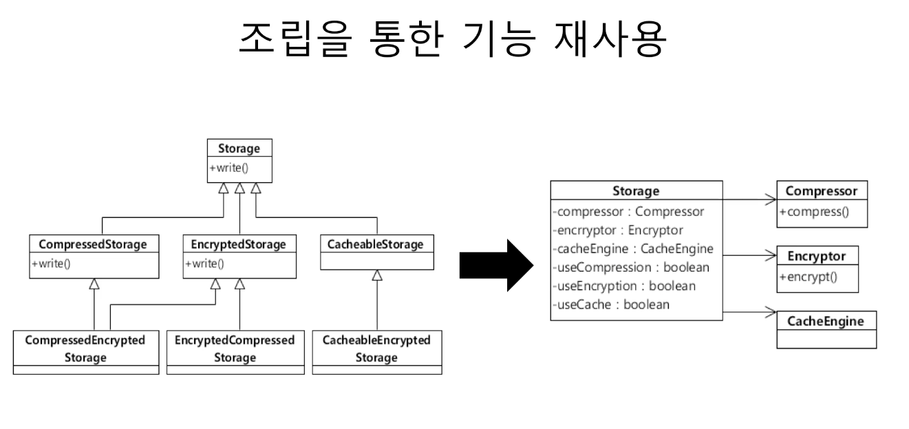

소프트웨어의 가치: 변화

>Software maintenance is not "Keep it working like before."
>It is "Keep being useful in a changing world"
> - Jessica Kerr

비용과 변화
낮은 비용으로 변화할 수 있어야 함

이를 위한 방법
- 패러다임 
  - 객체 지향, 함수형, 리액티브
- 코드 설계 아키텍처
 - DRY, TDD, SOLID, DDD, ..
 - 클린 아키텍처, MSA, ... 
- 업무 프로세스 / 문화
  - 애자일, DevOps, ...
  
객체 지향과 비용  

캡슐화 + 다형성(추상화)  
         
---
# 절차 지향 vs 객체지향

절차지향은 데이터 바탕으로 작동
객체지향은 다른 객체의 데이터에 바로 접근할 수 없고 프로시저를 통해 접근해야 한다.

# 객체란

객체의 핵심 -> 기능 제공
 - 객체는 제공하는 기능으로 정의
    - 내부적으로 가진 필드(데이터)로 정의하지 않음
    
 - 예) 회원 객체
    - 암호 변경하기 기능
    - 차 여부 확인 하기 기능

  - 예: 소리 제어기
    - 소리 크기 증가하기 기능
    - 소리 크기 감소하기 기능

---
## 기능 명세
- 메서드(오퍼레이션)를 이용해서 기능 명세
    - 이름, 파라미터, 결과로 구성
    
## 객체와 객체
객체와 객체는 기능을 사용해서 연결
- 기능 사용 = 메소드 호출

## 용어: 메시지
객체와 객체 상호 작용: 메시지를 주고 받는다고 표현
    - 메서드를 호출하는 메시지, 리턴하는 메시지, 익셉션 메시지

---
# 캡슐화(Encapsulation)
데이터 + 관련 기능 묶기

객체가 기능을 어떻게 구현했는지 외부에 감추는 것
    - 구현에 사용된 데이터의 상세 내용을 외부에 감춤 (요즘은 정보은닉 개념을 포함 )

정보 은닉(Information Hiding)의 의미 포함

외부에 영향 없이 객체 내부 구현 변경 가능


캡술화하지 않으면

>요구사항의 변화가 데이터 구조/사용에 변화를 발생시킴
>-> 데이터를 사용하는 여러 코드의 수정 발생

요구 사항 변경 예
- 장기 사용자에게 특정 기능 실행 권한을 연장(단 유효 일자는 그대로 유지)
- 계정을 차단하면 모든 실행 권 없음
- Date를 LocalDateTime으로 변경

데이터를 공유하는 절차지향의 단점

### 캡슐화 하면
기능을 제공하고 구현 상세를 감춤

캡슐화는 연쇄적인 변경 전파를 최소화

>요구사항의 변화가 내부 구현을 변경
>-> 캡슐화된 기능을 사용하는 코드 영향 최소화

### 캡슐화와 기능
캡슐화 시도 -> 기능에 대한 (의도) 이해를 높임

### 캡슐화를 위한 규칙
- Tell, Don't Ask : 데이터를 달라 하지 말고 해달라고 하기
- Demeter's Law
    - 메서드에서 생성한 객체의 메서드만 호출
    - 파라미터로 받은 객체의 메서드만 호출
    - 필드로 참조하는 객체의 메서드만 호출
    
### 정리
- 캡슐화: 기능의 구현을 외부에 감춤
- 캡슐화를 통해 기능을 사용하는 코드에 영향을 주지 않고 (또는 최소화) 내부 구현을 변경할 수 있는 유연함

# 다형성과 추상화
## 다형성(Polymorphism)
- 여러 모습을 갖는 것
- 객체 지향에서는 한 객체가 여러 타입을 갖는 것
    - 즉 한 객체가 여러 타입의 기능을 제공
    - 타입 상속으로 다형성 구현
        - 하위 타입은 상위 타입도 
        
### 다형성 예
```java
public class Timer {
  public void start() {..}
  public void stop() {..}
} 

public interface Rechargeable {
  void charge(); 
}

public class IotTimer extends Timer implements  Rechargeable {
  public void charge() {
    ...
  }
}

IotTimer it = new IotTimer();
it.start();
it.stop();

Timer t = it;
t.start();
t.stop();

Rechargeable r = it;
r.charge();
```

## 추상화 (Abstraction)
- 데이터나 프로세스 등을 의미가 비슷한 개념이나 의미 있는 표현으로 정의하는 과정
- 두 가지 방식의 추상화
    - 특정한 성질, 공통 성질(일반화)
- 간단한 예
    - DB의 USER 테이블: 아이디, 이름, 이메일
    - Money 클래스: 통화, 금액
    - 프린터: HP MXXX, 삼성 SL-M2XXX
    - GPU: 지포스, 라데온
    
## 서로 다른 구현 추상화
1. SCP로 파일 업로드
2. HTTP로 데이터 전송
3. DB 테이블에 삽입

추상화=>

푸시발송

## 타입 추상화
- 여러 구현 클래스를 대표하는 상위 타입 도출
  - 흔히 인터페이스 타입으로 추상화
  - 추상화 타입과 구현은 타입 상속으로 연결
  
> 기능에 대한 의미 제공
> 구현은 제공하지 않음
> 어떻게 구현할지 알 수 없음
 <<Interface>>  
  **Notifier**  
  +notify(noti: Notification)

EmailNotifier, SMSNotifier, KakaoNotifier - 콘크리트(concrete) 클래스

## 추상 타입 사용
- 추상 타입을 이용한 프로그래밍
````java
Notifier notifier = getNorifier(..);
notifier.notify(someNoti);
````
- 추상 타입은 구현을 감춤
    - 기능의 구현이 아닌 의도를 더 잘 드러냄
    
## 추상 타입 사용에 따른 이점: 유연함
- 콘크리트 클래스를 직접 사용하면..
1.
```java
private SmsSender smsSender;

public void cancle(String ono) {
    ... 주문 취소 처리
    smsSender.sendSms(...);
}
```
2.
```java
private SmsSender smsSender;
private KakaoPush kakaoPush;

public void cancle(String ono) {
    ... 주문 취소 처리
    if (pushEnabled) {
        kakaoPush.push(..);
    } else {
        smsSender.sendSms(...);
    }
}
```
3.
```java
private SmsSender smsSender;
private KakaoPush kakaoPush;
private MailService mailSvc;

public void cancle(String ono) {
    ... 주문 취소 처리

    if (pushEnabled) {
        kakaoPush.push(..);
    } else {
        smsSender.sendSms(...);
    }
    mailSvc.endMail(..);
}
```
1과 같은 상황에서 카카오 푸시가 추가되면 2와같은 코드가 추가되고  
또 메일로 노티를 해주는 기능이 추가가 되면 3과 같은 코드가 된다.
이렇게 구현하게 되면 주문 취소라는 본래의 로직변경이 아님에도    
요구 사항 변경에 따라 주문 취소 코드도 함께 변경되야 한다.  
즉, 본질과 상관없는 다른 요구사항의 변경 때문에 본질을 구현하고 있는 기능(코드)에 변화가 생긴다.  
이러한 문제를 추상 타입을 이용하여 유연하게 고쳐보면..
### 추상 타입 사용 이점: 유연함
- 공통점을 도출하면
SMS 전송, 카카오톡 보냄, 이메일 발송 | 추상화 >> 통지
```java
public void cancle(String ono) {
  .. 주문 취소 처리
    
  Notifier notifier = getNotifier(..);
  notifier.notify(..);
}

private Notifier getNotifier(..) {
  if (pushEnabled) {
    return new KakaoNotifier();
  } else {
    return new SmsNotifier();
  }
}
```
하지만 위 코드는 실제 구현부 getNotifier 메서드 안에 구현되어 있기 때문에  
위 소스를 사용할 대상 접근 자체도 추상화를 하면..
```java
public void cancle(String ono) {
  .. 주문 취소 처리
  Norifier notifier = NotifierFactory.instance().getNotifier(..);
  notifier.notify(..);
}

public interface NotifierFactory {
  Notifier getNotifier(..);
  
  static NotifierFactory instance() {
    return new DefaultNotifierFactory();
  }
}

public DefaultNotifierFactory implements NotifierFactory {
  public Notifier getNotifier(..) {
    if (pushEnabled) {
      return new KakaoNotifier();
    } else {
      return new SmsNotifier();
    }
  }
}
```
이런식으로 코드를 구현하면 통지 방식이 변경 되더라도 본래의 주문 취소의 로직은 변경되지 않으면서  
통지 방식은 변경 할 수 있는 유연함을 갖게 된다.  

## 추상화는 의존 대상이 변경하는 시점에
- 추상화 -> 추상 타입 증가 -> 복잡도 증가
    - 아직 존재하지 않는 기능에 대한 이른 추상화는 주의: 잘못된 추상화 가능성, 복잡도만 증가
    - 실제 변경/확장이 발생할 때 추상화 시도
    
## 추상화를 잘 하려면
- 구현을 한 이유가 무엇 때문인지 생각해야 함
SmsSender, KakaoPush, MailService 모두 Notifier 혹은 Messenger로 추상화 할 수 있다.

## 추상화 예제
클라우드 파일 통합 관리 기능 개발이라는 관점에서 추상화 하지 않은 코드와 추상화 한 코드로 비교해 봅니다.  
기능 예시
- 클라우드 파일 통합 관리 기능 개발
- 대상 클라우드
    - 드롭박스, 박스
- 주요 기능
    - 각 클라우드의 파일 목록 조회, 다운로드, 업로드, 삭제, 검색

[추상화 안 한 예시 코드](src/main/java/oop/polymorphism/asis/CloudFileManager.java)

추상화 하지 않은 코드는 시간이 지나고 요구사항이 늘어날수록 if-else 블록이 늘어나게 된다.  
이는 곧 개발 시간의 증가로 이어진다. 이외의 개발 시간이 증가시키는 요인으로는  
- 코드 구조가 길어지고 복잡해짐
  - 새로운 클라우드 추가시 모든 메서드에 새로운 if 블록 추가
    - 중첩 if-else는 복잡도 배로 증가
    - if-else가 많을 수록 진척 더딤 (신중 모드)
- 관련 코드가 여러 곳에 분산됨
  - 한 클라우드 처리와 관련된 코드가 여러 메서드에 흩어짐
- 결과적으로, 코드 가독성과 분석 속도 저하
  - 코드 추가에 따른 노동 시간 증가
  - 실수하기 쉽고 이로 인한 불필요한 디버깅 시간 증가

[추상화 한 예시 코드](src/main/java/oop/polymorphism/tobe/CloudFileManager.java)
클라우드 파일 시스템 설계  
</img>

이것이 바로 OCP(Open-Closed Principle)  
추상화를 잘 적용하면 CloudFileManager 객체는   
다른 클라우드에 대한 기능적인 확장에는 열려있지만
기능이 추가 된다고 해도 CloudFileManager 객체의 코드 수정은 필요 없게 되서  
수정에는 닫혀 있게 된다.

# 상속보단 조립
 

상속은 재사용성을 늘려주지만 아래와 같은 단점이 발생할 수 있다.
- 상위 클래스 변경 어려움
    - 변경의 여파가 계층도를 따라 전파됨
    - 상위 클래스는 하위 클래스에 대해 캡슐화가 어려워짐
- 클래스 증가
- 상속 오용

## 상속의 단점 해결 방법 -> 조립
- 조립(Composition)
  - 여러 객체를 묶어서 더 복잡한 기능을 제공
  - 보통 필드로 다른 객체를 참조하는 방식으로 조립
  - 또는 객체를 필요 시점에 생성/구함
```java
public class FlowController {
  private Encryptor encryptor = new Encrytot(); // 필드로 조립
  
  public void process() {
    ...
    byte[] encryptedData = encryptor.encryt(data);
    ... 
  }
}
```


>상속보다는 조립(Composition over inheritance)
>- 상속하기에 앞서 조립으로 풀 수 없는지 검토
>- 진짜 하위 타입인 경우에만 상속 사용

# 기능과 책임 분리
## 기능 분해
**기능은 하위 기능으로 분해**
암호 변경 기능을 예로 들었을 때
- 암호 변경
  - 변경 대상 확인
    - 변경 대상 구함
    - 대상 없으면 오류 응답
  - 대상 암호 변경
    - 암호 일치 여부 확인
      - 불일치 하면 암호 불일치 응답
    - 암호 데이터 변경
    
## 기능을 누가 제공할 것인가?
### 기능은 곧 책임 
 분리한 각 기능을 알맞게 분배
 
- 암호 변경 [ChangePasswordService]
  - 변경 대상 확인
    - 변경 대상 구함 [MemberRepository]
    - 대상 없으면 오류 응답
  - 대상 암호 변경 [Member]
    - 암호 일치 여부 확인
      - 불일치 하면 암호 불일치 응답
    - 암호 데이터 변경 
    
### 큰 클래스, 큰 메서드
- 클래스나 메서드가 커지면 절차 지향의 문제 발생
  - 큰 클래스 -> 많은 필드를 많은 메서드가 공유
  - 큰 메서드 -> 많은 변수를 많은 코드가 고융
  - 여러 기능이 한 클래스/메서드에 섞여 있을 가능성
- 책임에 따라 알맞게 코드 분리 필요
- 필드나 변수는 곧 데이터이기 때문에 서로 다른코드가 데이터를 읽고 변경하면서 점점 코드를 분경하기 어려워 진다.  

#### 책임 분배/분리 방법
- 패턴 적용
- 계산 기능 분리
- 외부 연동 분리
- 조건별 분기는 추상화

# 패턴 적용
## 전형적인 역할 분리
- 간단한 웹
  - 컨트롤러, 서비스, DAO
- 복잡한 도메인
  - 엔티티, 밸류, 리포지토리, 도메인 서비스
- AOP
  - Aspect(공통 기능)
- GoF
  - 팩토리, 빌더, 전략, 템플릿 메서드, 프록시/데코레이터 등

## 계산 분리
분리 전
```java
Member member = memberRepository.findOne(id);
Product product = productRepository.findOne(prodId);

int payAmount = product.price() * orderReq.getAmount();
double pointRate = 0.01;
if (member.getMembership() == GOLD) {
  pointRate = 0.03;
} else if (member.getMembership() == SILBER) {
  pointRate = 0,02;
}
if (isDoublePointTarget(product)) {
  pointRate *= 2;
}

int point = (int) (payAmount * pointRate);
```

분리 후
```java
Member member = memberRepository.findOne(id);
Product product = productRepository.findOne(prodId);

int payAmount = product.price() * orderReq.getAmout();
PointCalculator cal = new PointCalculator(
  payAmount, member.getMemberShip(), product.getId()
);
int point = cal.calculate();

public class PointCalculator {
  ...membership, payAmount, prodId 필드/생성자
    
  public int calculate() {
    double pointRate = 0.01;
    if (member.getMembership() == GOLD) {
      pointRate = 0.03;
    } else if (member.getMembership() == SILBER) {
      pointRate = 0,02;
    }
    if (isDoublePointTarget(product)) pointRate *= 2;
    return (int) (payAmount * pointRate);  
  }
}
```

## 연동 분리
네트워크, 메시징, 파일 등 연동 처리 코드 분리

분리 전
```java
Product prod = findOne(id);

RestTemplate rest = new RestTemplate();
List<RecoItem> recoItems = 
  rest.get("http://internal/recommend?id=" + prod.getId() + 
  "&user=" + userId + "&category=" + prod.getCategory(),  
  RecoItem.class);
```

분리 후
```java
Product prod = findOne(id);

RecommendService recoService = new RecommendService();
List<RecoItem> recoItems = 
  recoService.getRecoItems(prod.getId(), userId, prod.getCategory());

```

## 연속적인 if-else는 추상화 고민

분리 전
```java
String fileUrl = "";
if (fileId.startWith("local:")) {
  fileUrl = "/files/" + fileId.substring(6);

} else if (fileId.startWith("ss:")) {
  fileUrl = "http:/fileserver/files/" + fileId.substring(3);
}
```

분리 후
```java
FileInfo fileInfo = FileInfo.getFileInfo(fileUrl);
String fileUrl = fileInfo.getUrl();
 
  *  *  *

public interface FileInfo {
  String getUrl();

  static FileInfo getFileInfo(..) {...}
}

  *  *  *

public class SSFileInfo implements FileInfo {
  private String fileId;
  
  public String getUrl() {
    return "http://fileserver/files/" +
        fileId.substring(3);
  }
}
```
> 주의: 의도 잘 드러나는 이름 사용
> 예, HTTP로 추천 데이터 읽어오는 기능 분리시
> - RecommendService > HttpDataService

#### 역할 분리가 잘 되면? 테스트도 용이해짐

---

# 의존과 DI

## 의존
기능 구현을 위해 다른 구성 요소를 사용하는 것
- 의존의 예: 객체 생성, 메서드 호출, 데이터 사용
  
의존은 변경이 **전파**될 가능성을 의미
- 의존하는 대상이 바뀌면 바뀔 가능성이 높아짐
  - 예: 호출하는 메서드의 파라미터가 변경
  - 예: 호출하는 메서드가 발생할 수 있는 익셉션 타입이 추가

## 순환 의존은 의험하다!
- 순환 의존 -> 변경 연쇄 전파 가능
  - 클래스, 패키지, 모듈 등 모든 수준에서 순환 의존이 없게 해야 한다.

의존의 대상은 적을수록 좋다


#### 의존 대상이 많을 때 
- 기능이 많을 때  
  - 기능 별로 분리 고려  
예시
```java
public class UserService {
  public void regist(..) {
    ...
  }
  public void changePw(..) {
    ...
  }
  public void blockUser(..) {
    ...
  }
}
```
분리 예시
```java
public class UserRegistService {
  public void regist(..) {
    ...
  }
}

public class ChangePwService {
  public void changePw(..) {
    ...
  }
}

public class UserBlockService {
  public void blockUser(..) {
    ...
  }
}
```

#### 의존 대상이 많을 때 2, 묶어 보기
- 몇 가지 의존 대상을 단일 기능으로 묶어서 생각해보면 의존 대상을 줄일 수 있음

## 의존 대상 객체를 직접 생성하면?
- 생성 클래스가 바뀌면 **의존**하는 코드도 바뀜  
- 의존 대상 객체를 직접 생성하지 않는 방법
  - 팩토리, 빌더
  - 의존 주입(Dependency Injection)
    - 외부에서 의존 객체를 주입
      - 생성자나 메서드, 필드를 이용해서 주입
  - 서비스 로케이터(Service Locator)


## 조립기(Assembler)
- 조립기가 객체 생성, 의존 주입을 처리
  - 예: 스프링 프레임워크
```java
@Configuration
public class Config {
  @Bean
  public ScheduleService scheduleSvc() {
    ScheduleService svc = 
        new ScheduleService(repo());
    svc.setCalculator(expCal());
    return svc;
  }

  @Bean
  public UserRepository repo() {...}

  @Bean
  public Calculator expCal() {...}

}
```
```java
// 초기화
ctx = new AnnotationConfigApplicationContext(Config.class);

// 사용할 객체 구함
ScheduleService svc = ctx.getBean(ScheduleService.class);

// 사용
svc.getSchedule(..);

```

### DI 장점 1
상위 타입을 사용할 경우 의존 대상이 바뀌면 조립기(설정)만 변경 하면 

#### DI 장점 2
의존하는 객체 없이 대역 객체를 사용해서 테스트 가능
